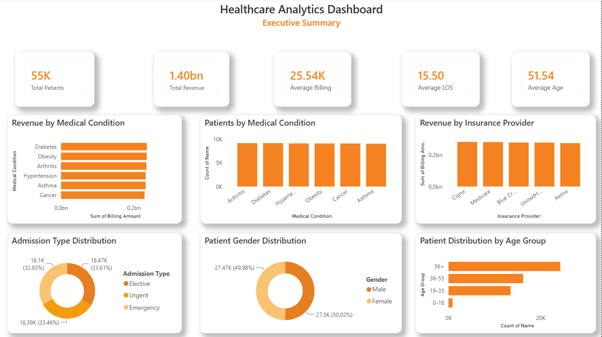
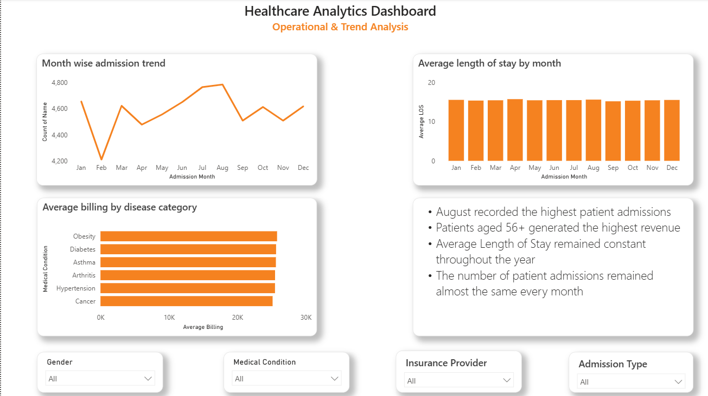

#  Healthcare Analytics Dashboard

An interactive Healthcare Analytics Dashboard built using Power BI to analyze approximately 55,500 healthcare records and provide meaningful business insights into patient demographics, revenue, insurance providers, medical conditions, and operational trends.

---

##  Project Overview

This project demonstrates an end-to-end healthcare analytics workflow:

- Data profiling using SQL
- Data cleaning and transformation
- Interactive dashboard development in Power BI
- DAX calculations for KPIs and calculated columns
- Business insight generation through visual analytics

---

##  Dashboard Preview

### Executive Summary



---

### Operational & Trend Analysis



---

##  Key KPIs

- Total Patients
- Total Revenue
- Average Billing
- Average Length of Stay (LOS)
- Average Patient Age

---

##  Dashboard Features

### Executive Dashboard

- Revenue by Medical Condition
- Patients by Medical Condition
- Revenue by Insurance Provider
- Admission Type Distribution
- Patient Gender Distribution
- Patient Distribution by Age Group

### Operational Dashboard

- Monthly Admission Trend
- Average Length of Stay by Month
- Average Billing by Disease Category
- Interactive Slicers
  - Gender
  - Medical Condition
  - Insurance Provider
  - Admission Type

---

##  Tools & Technologies

- Microsoft Power BI
- DAX
- SQL
- Power Query
- Microsoft Excel

---

##  Data Preparation

- Removed duplicate records
- Cleaned inconsistent data
- Created calculated columns using DAX
- Built interactive measures
- Designed responsive dashboards

---

## Repository Structure

```text
Dashboard/
Dataset/
Images/
SQL/
README.md
```

---

## SQL Files Included

- Data Profiling
- Data Cleaning
- Patient Analytics
- Clinical Analytics
- Financial Analytics
- Operational Analytics

---

## Business Insights

- Diabetes generated the highest revenue.
- Patients aged 56+ represented the largest patient group.
- Admission volume remained relatively stable throughout the year.
- Average Length of Stay remained consistent across months.
- Insurance providers generated similar revenue levels.


##  Skills Demonstrated

- Data Cleaning
- SQL Analysis
- DAX
- Power BI
- Dashboard Design
- Business Intelligence
- Data Visualization
- Healthcare Analytics
